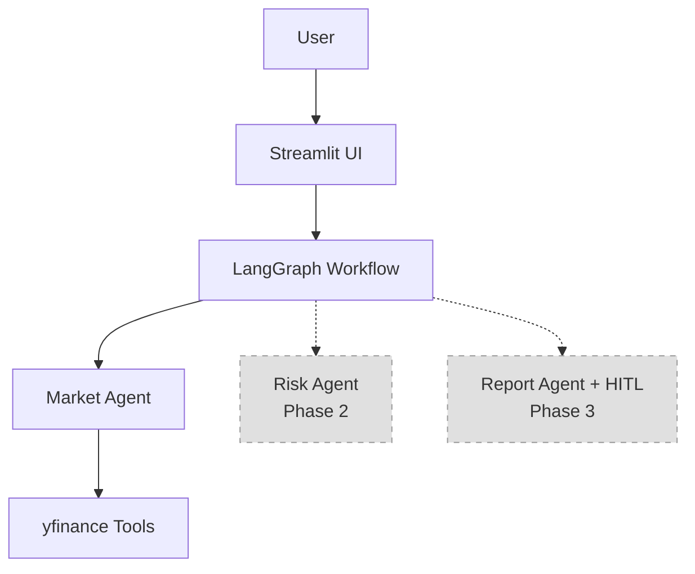

# 📈 Fintech AI Agent Playground


A production-structured monorepo for building financial AI agents. Phase 1 features a Market Research Agent powered by LangGraph and free financial data APIs.

## 🎯 Overview

The Fintech AI Agent Playground is a modular platform designed for solo developers and fintech professionals to build and deploy AI-powered financial analysis tools. The system uses only free services and APIs, making it accessible for portfolio projects and learning.

## 🏗️ Architecture



## 🚀 Live Demo

[Deploy to Streamlit](your-url-here) *(Coming Soon)*

## ⚙️ Local Setup

### Prerequisites
- Python 3.14
- Git

### Installation

```bash
# Clone the repository
git clone <your-repo-url>
cd fintech-ai-agent-playground

# Create virtual environment
python -m venv .venv

# Activate (Mac/Linux)
source .venv/bin/activate

# Activate (Windows)
.venv\Scripts\activate

# Install dependencies
pip install -r requirements.txt
```

### Configuration

1. **Get API Keys** (both free):
   - **Google AI Studio**: https://aistudio.google.com → "Get API Key"
   - **Groq Console**: https://console.groq.com → "API Keys" (optional fallback)

2. **Set up secrets**:
   ```bash
   # Edit .streamlit/secrets.toml
   # Replace placeholder values with your actual API keys
   ```

3. **Run the app**:
   ```bash
   streamlit run app.py
   ```

## 🔑 Free API Keys

### Primary: Google AI Studio (Gemini 2.5 Flash)
- **Cost**: Free
- **Rate Limit**: Generous for development
- **Context Window**: 1M tokens
- **Sign up**: https://aistudio.google.com

### Fallback: Groq (Llama 3.3 70B)
- **Cost**: Free
- **Rate Limit**: Good for development
- **Speed**: Very fast inference
- **Sign up**: https://console.groq.com

## 🗺️ Roadmap

| Phase | Feature | Status |
|-------|---------|--------|
| 1 | Market Research Agent | ✅ Complete |
| 2 | Risk Scoring Agent | 🔜 Coming Soon |
| 3 | Report Writer + HITL | 🔜 Coming Soon |

### Phase 1 ✅ - Market Research Agent
- Current stock price and trading data
- Fundamental analysis (P/E, market cap, EPS, dividends)
- Historical price analysis with key statistics
- Earnings history and surprise calculations
- Multi-stock comparisons
- Company name to ticker resolution

### Phase 2 🔜 - Risk Scoring Agent
- Synthetic transaction generation
- Rule-based risk scoring algorithms
- Portfolio risk analysis
- Risk metrics and reporting

### Phase 3 🔜 - Report Writer + Human-in-the-Loop
- Automated report generation
- Customizable report templates
- Human approval workflows
- Export functionality

## 📁 Project Structure

```
fintech-ai-agent-playground/
├── agents/
│   └── market_agent.py        # LangGraph agent logic
├── tools/
│   └── market_tools.py        # yfinance tool wrappers
├── graph/
│   └── workflow.py            # StateGraph assembly and compilation
├── config/
│   └── settings.py            # LLM provider abstraction + centralized config
├── .streamlit/
│   └── secrets.toml           # Local secrets (gitignored)
├── .python-version            # Contains: 3.14
├── app.py                     # Streamlit entry point (max 150 lines)
├── requirements.txt           # All dependencies
├── .gitignore
├── docs/
│   └── architecture.md        # ADR-style design decisions + Mermaid diagram
└── README.md                  # This file
```

## 🛠️ Key Features

### LLM Provider Abstraction
Switch between LLM providers by changing one line in `config/settings.py`:
```python
LLM_PROVIDER = "gemini"  # Change to "groq" to switch providers
```

### LangGraph Integration
- StateGraph with MessagesState for conversation management
- MemorySaver for persistent chat history
- ReAct agent pattern with tool binding
- Extensible architecture for multi-agent workflows

### Free Financial Data
- Yahoo Finance integration via yfinance
- Real-time stock prices and fundamentals
- Historical data and earnings information
- No API costs or rate limiting concerns

## 🎨 UI Features

- **Modern Chat Interface**: Streamlit-based chat with user/assistant roles
- **Session Persistence**: Chat history maintained within browser sessions
- **Example Prompts**: Pre-configured example questions for new users
- **Provider Display**: Shows active LLM provider in sidebar
- **Error Handling**: Graceful error handling with user-friendly messages

## 🔧 Development

### Adding New Agents

1. Create new agent file in `agents/`
2. Register node in `graph/workflow.py` at marked locations
3. No changes needed to `app.py` or `tools/`

### Adding New Tools

1. Add `@tool` function to `tools/market_tools.py`
2. Import and bind in `agents/market_agent.py`
3. Return type must be `str` for LLM compatibility

## ⚠️ Disclaimer

This application is for educational and portfolio demonstration purposes only. All financial information is provided "as is" without warranty. Not financial advice.

## 📄 License

MIT License - feel free to use for learning and portfolio projects.

## 🤝 Contributing

Open to contributions for Phase 2 and 3 features. Please follow the existing architecture patterns and maintain the free-only constraint.
