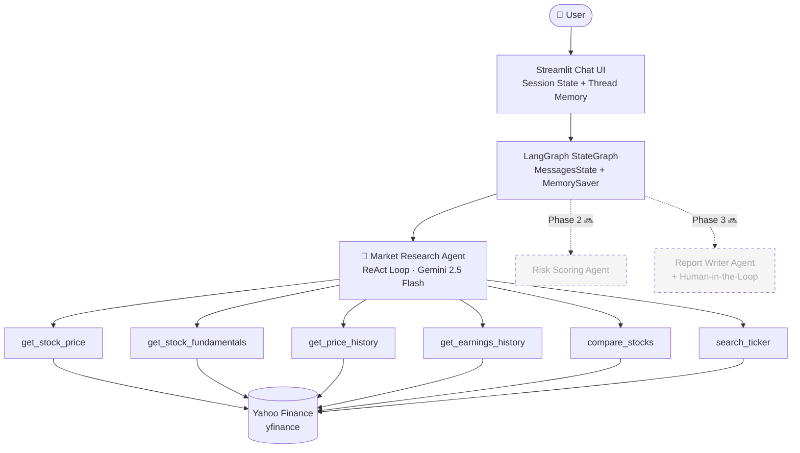

# 🏦 Fintech AI Agent Playground

> **A production-architected, multi-agent AI system for real-time financial
> market research — built with LangGraph, Google Gemini 2.5 Flash, and
> modern agentic design patterns.**

[](https://python.org)
[](https://langchain-ai.github.io/langgraph/)
[](https://streamlit.io)
[](https://aistudio.google.com)
[](LICENSE)
[](https://your-url.streamlit.app)

---

## 🚀 Live Demo

**[▶ Try the Live Agent →](https://your-url.streamlit.app)**

Ask it anything:
- *"What are NVDA's last 4 earnings surprises?"*
- *"Compare AAPL, MSFT, and GOOGL by P/E ratio and market cap"*
- *"Show me TSLA's 6-month price history with drawdown analysis"*

---

## 🎯 Project Overview

This project demonstrates **production-grade agentic AI architecture** applied
to the fintech domain. It is Phase 1 of a three-phase multi-agent system,
built to showcase the design patterns and engineering principles used in
enterprise AI platforms at scale.

The system implements a **ReAct (Reasoning + Acting) agent loop** using
LangGraph's stateful graph execution engine, with real-time financial data
retrieval via Yahoo Finance. The LLM provider is fully abstracted, enabling
hot-swapping between Google Gemini and Groq Llama with a single configuration
change — a pattern directly applicable to production fintech systems where
vendor flexibility is an architectural requirement.

---

## 🏗️ Architecture



---

## 🧠 Agentic Design Patterns Implemented

This project is a practical implementation of the four canonical agentic
AI design patterns as defined in current AI engineering literature:

| Pattern | Implementation |
|---|---|
| **ReAct (Reason + Act)** | Agent iterates through Thought → Tool Call → Observation cycles until confident |
| **Tool Use** | 6 structured yfinance tools with typed signatures and docstring-driven selection |
| **Reflection** | Agent self-evaluates tool outputs before composing final response |
| **Memory** | LangGraph MemorySaver with per-session thread IDs for stateful conversations |

---

## 🛠️ Tech Stack

| Layer | Technology | Role |
|---|---|---|
| **Agent Orchestration** | LangGraph v1.0 | Stateful graph execution, tool binding, memory |
| **Primary LLM** | Google Gemini 2.5 Flash | 1M token context, tool calling, reasoning |
| **Fallback LLM** | Groq · Llama 3.3 70B | High-throughput inference fallback |
| **Market Data** | yfinance | Real-time prices, fundamentals, earnings |
| **UI Framework** | Streamlit | Chat interface, session state, deployment |
| **Language** | Python 3.14 | Latest stable runtime |

---

## 📁 Repository Structure

```
fintech-ai-agent-playground/
├── agents/
│   └── market_agent.py        # ReAct agent with tool binding
├── tools/
│   └── market_tools.py        # 6 yfinance-powered financial tools
├── graph/
│   └── workflow.py            # LangGraph StateGraph orchestration
├── config/
│   └── settings.py            # LLM provider abstraction layer
├── docs/
│   └── architecture.md        # Architecture Decision Records (ADR)
├── app.py                     # Streamlit UI (< 150 lines)
└── requirements.txt
```

> **Designed for extensibility:** Adding Phase 2 or Phase 3 agents requires
> only a new file in `agents/` and a new node in `graph/workflow.py` —
> zero changes to `app.py` or `tools/`.

---

## ⚙️ Local Setup

```bash
# 1. Clone the repository
git clone https://github.com/YOUR-USERNAME/fintech-ai-agent-playground.git
cd fintech-ai-agent-playground

# 2. Create and activate virtual environment
python -m venv .venv
source .venv/bin/activate        # Mac/Linux
.\.venv\Scripts\Activate.ps1     # Windows PowerShell

# 3. Install dependencies
pip install -r requirements.txt

# 4. Configure API keys
cp .streamlit/secrets.toml.example .streamlit/secrets.toml
# Add your keys to .streamlit/secrets.toml (see API Keys section below)

# 5. Run the app
streamlit run app.py
```

---

## 🧱 Design Patterns

This project is a living reference implementation of both **Agentic AI**
and **Software Engineering** design patterns applied to a production
fintech context.

### Agentic AI Patterns
| Pattern | Status |
|---|---|
| ReAct (Reason + Act) | ✅ Phase 1 |
| Tool Use | ✅ Phase 1 |
| Reflection | ✅ Phase 1 |
| Stateful Memory | ✅ Phase 1 |
| Planning | ✅ Phase 1 |
| Multi-Agent Orchestration | 🔜 Phase 2 |
| Human-in-the-Loop (HITL) | 🔜 Phase 3 |

### Software Engineering Patterns
| Pattern | Implementation |
|---|---|
| Factory | `get_llm()` in `config/settings.py` |
| Strategy | `LLM_PROVIDER` swap in `config/settings.py` |
| Facade | Tool layer over yfinance API |
| Repository | Data access encapsulated in `tools/` |
| Open/Closed Principle | Extensible StateGraph in `graph/workflow.py` |
| Single Responsibility | One concern per module across entire codebase |
| Dependency Injection | LLM injected into agent via factory |
| Graceful Degradation | Try/except on all external tool calls |
| Singleton via Cache | `@st.cache_resource` on compiled workflow |

---

## 🔑 API Keys

| Provider | Model | Get Key |
|---|---|---|
| Google AI Studio | Gemini 2.5 Flash | [aistudio.google.com](https://aistudio.google.com) |
| Groq Console | Llama 3.3 70B | [console.groq.com](https://console.groq.com) |

Add your keys to `.streamlit/secrets.toml`:
```toml
GOOGLE_API_KEY = "your-key-here"
GROQ_API_KEY   = "your-key-here"
```

---

## 🔄 Switching LLM Providers

The LLM layer is fully abstracted. To switch from Gemini to Groq,
change **one line** in `config/settings.py`:

```python
LLM_PROVIDER = "groq"   # was "gemini"
```

No other files change. This pattern mirrors production fintech systems
where LLM vendor flexibility is a hard architectural requirement.

---

## 🗺️ Roadmap

| Phase | Feature | Status |
|---|---|---|
| **1** | Market Research Agent — ReAct loop, 6 financial tools, chat memory | ✅ Live |
| **2** | Risk Scoring Agent — transaction analysis, rule-based risk engine | 🔜 In Progress |
| **3** | Report Writer Agent + Human-in-the-Loop approval workflow | 🔜 Planned |

---

## 📐 Architecture Decisions

Full Architecture Decision Records are in [`docs/architecture.md`](docs/architecture.md).

Key decisions:
- **LangGraph over CrewAI/AutoGen** — explicit state control, production-grade
  checkpointing, and native HITL support required for regulated fintech environments
- **Gemini 2.5 Flash as primary** — 1M token context window handles full
  earnings reports and multi-stock comparisons in a single prompt
- **Provider abstraction in `config/settings.py`** — decouples agent logic
  from LLM vendor, enabling zero-code provider migration
- **Monorepo structure** — shared tooling, unified deployment pipeline,
  and single source of truth for a cohesive portfolio narrative

---

## 👤 Author

Built by **[Your Name](https://linkedin.com/in/your-profile)** —
AI Engineer & Architect specializing in agentic AI systems, LLM orchestration,
and fintech platform architecture.

📫 [LinkedIn](https://linkedin.com/in/your-profile) ·
🐙 [GitHub](https://github.com/YOUR-USERNAME) ·
🌐 [Portfolio](https://your-portfolio.com)

---

## ⚠️ Disclaimer

This application is for **educational and portfolio demonstration purposes only**.
All market data is sourced from Yahoo Finance via the yfinance library.
Nothing in this application constitutes financial advice.
