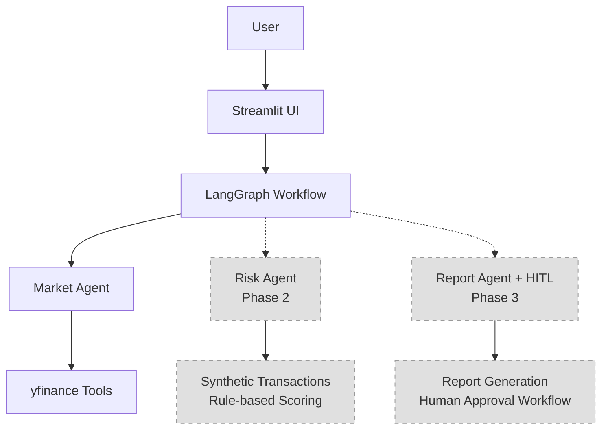

# Architecture Decision Record (ADR)

## 🎯 Project Overview

Financial intelligence at the institutional level has historically required
expensive data terminals, proprietary platforms, and dedicated quant teams.
This project challenges that assumption.

**Fintech AI Agent Playground** is a production-architected, multi-agent AI
system that applies enterprise-grade agentic design patterns to real-time
financial market research. Built on LangGraph's stateful graph execution
engine, the system orchestrates autonomous AI agents that reason, retrieve
live market data, reflect on findings, and synthesize institutional-quality
analysis — on demand, in natural language.

This is not a tutorial project. The codebase is structured to the same
architectural standards used in production fintech AI platforms:

- **Separation of concerns** — agent logic, tool layer, graph orchestration,
  and UI are fully decoupled across independent modules
- **Provider-agnostic LLM layer** — switching inference providers requires
  changing one line, with zero impact on agent behavior
- **Horizontal extensibility** — new agents plug into the orchestration graph
  without modifying existing components, following the Open/Closed Principle
- **Governed autonomy** — Phase 3 introduces Human-in-the-Loop checkpoints,
  a non-negotiable pattern in regulated financial AI systems

The system is Phase 1 of a three-phase multi-agent architecture — each phase
adding a new specialist agent to the orchestration graph, progressively
demonstrating the full spectrum of agentic AI design patterns as defined in
current AI engineering research.

## Architecture Diagram

## Design Decisions

### Why LangGraph over CrewAI or AutoGen

**Decision**: Use LangGraph as the primary orchestration framework.

**Rationale**:
- **State Management**: LangGraph's StateGraph provides explicit state management with MessagesState, making conversation persistence straightforward
- **Memory Integration**: Built-in MemorySaver enables persistent conversation history without additional infrastructure
- **Tool Integration**: Seamless integration with LangChain tools and the `@tool` decorator pattern
- **Scalability**: Linear workflow design easily extends to multi-agent systems in Phase 2 and 3
- **Performance**: Lower overhead compared to CrewAI's role-based agent system for single-agent use cases

### Why Gemini 2.5 Flash as Primary LLM

**Decision**: Use Google Gemini 2.5 Flash as the primary LLM with Groq as fallback.

**Rationale**:
- **Context Window**: 1M token context window allows for comprehensive market analysis without truncation
- **Cost**: Completely free tier with generous rate limits suitable for development and demo purposes
- **No Credit Card Required**: Unlike some competitors, Gemini's free tier doesn't require payment setup
- **Performance**: Fast inference speeds suitable for real-time chat interfaces
- **Reliability**: Google's infrastructure provides consistent uptime and performance

### Why the LLM Provider Abstraction Pattern

**Decision**: Implement centralized LLM provider abstraction in `config/settings.py`.

**Rationale**:
- **Single Point of Change**: Switching providers requires changing only one variable (`LLM_PROVIDER`)
- **Consistent Interface**: All agents use the same `get_llm()` function, ensuring uniform configuration
- **Environment Flexibility**: Supports both Streamlit secrets and environment variables for deployment
- **Testing**: Easy to mock the LLM for unit testing and development
- **Future-Proof**: Adding new providers requires minimal code changes

### Why Monorepo over Separate Repos

**Decision**: Structure as a monorepo with clear module separation.

**Rationale**:
- **Shared Dependencies**: Common configuration, utilities, and dependencies are centralized
- **Coordinated Development**: Easier to maintain consistent versions and interfaces across agents
- **Deployment Simplicity**: Single deployment target for Streamlit Community Cloud
- **Code Reuse**: Tools and utilities can be shared across different agents in future phases
- **Developer Experience**: Faster onboarding with unified development environment

### Why yfinance over Paid Financial Data APIs

**Decision**: Use yfinance as the exclusive market data source.

**Rationale**:
- **Free Access**: No API costs or subscription requirements
- **Comprehensive Data**: Provides price history, fundamentals, earnings data, and company information
- **Reliability**: Well-maintained library with consistent data quality
- **Rate Limits**: No strict rate limiting for development and demo usage
- **Community Support**: Large user base and extensive documentation

## Future Roadmap

### Phase 1 ✅ Market Research Agent (Current)
- **Status**: Complete
- **Features**: Stock price analysis, fundamentals, price history, earnings data, stock comparison, ticker search
- **Architecture**: Single-agent linear workflow with memory persistence

### Phase 2 🔜 Risk Scoring Agent
- **Status**: Coming Soon
- **Features**: Synthetic transaction generation, rule-based risk scoring, portfolio risk analysis
- **Architecture**: Multi-agent workflow with market → risk agent pipeline
- **Integration**: Extends existing workflow without modifying app.py or tools/

### Phase 3 🔜 Report Writer Agent + Human-in-the-Loop
- **Status**: Coming Soon
- **Features**: Automated report generation, human approval workflows, customizable templates
- **Architecture**: Supervisor node coordinating multiple specialized agents
- **Integration**: Adds conditional routing and approval workflows to existing graph

## Technical Architecture

### Core Components

1. **config/settings.py**: Centralized configuration and LLM provider abstraction
2. **tools/market_tools.py**: LangGraph-compatible yfinance tool wrappers
3. **agents/market_agent.py**: ReAct agent with Senior Equity Research Analyst persona
4. **graph/workflow.py**: StateGraph with MemorySaver for conversation persistence
5. **app.py**: Streamlit UI with chat interface and session management

### Data Flow

1. User input → Streamlit chat interface
2. Message conversion → LangChain message format
3. Workflow invocation → StateGraph with thread ID
4. Agent processing → Market agent with tool access
5. Tool execution → yfinance data retrieval
6. Response formatting → Structured analysis with citations
7. UI display → Chat message with disclaimer

### Memory Management

- **Session State**: Streamlit session state maintains chat history
- **Thread ID**: Unique UUID per browser session for LangGraph memory
- **Checkpointer**: MemorySaver persists conversation across interactions
- **Cache**: @st.cache_resource compiles workflow once per session

## Security Considerations

- **API Keys**: Stored only in .streamlit/secrets.toml (gitignored) and environment variables
- **Input Validation**: All tools include exception handling and input sanitization
- **Rate Limiting**: Relies on provider-side rate limiting (Gemini/Groq free tiers)
- **Data Privacy**: No user data persistence beyond session state
- **Disclaimer**: Educational purpose disclaimer included in all responses
